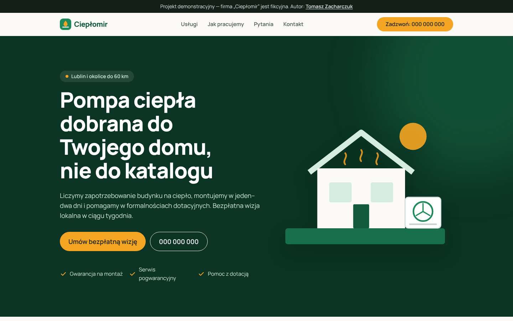

# Ciepłomir — strona-wizytówka dla lokalnej firmy (projekt demo)

Szablon strony internetowej dla małej firmy usługowej, na przykładzie **fikcyjnej** firmy
montującej pompy ciepła w Lublinie. Projekt pokazuje, jak buduję strony dla MŚP: szybkie,
dostępne, przygotowane pod SEO lokalne i łatwe do przeniesienia na kolejnego klienta.

> Firma „Ciepłomir” nie istnieje. Dane kontaktowe i rejestrowe są zastępcze.



## Wyniki

Lighthouse (mobile): **Performance 100 · Accessibility 100 · Best Practices 100 · SEO 100**
LCP 1,2 s · CLS 0 · TBT 0 ms

## Stack

| Warstwa | Technologia |
|---|---|
| Framework | [Astro](https://astro.build) — generowanie statyczne, zero zbędnego JavaScriptu |
| Style | [Tailwind CSS v4](https://tailwindcss.com) |
| Font | Manrope hostowany lokalnie (`@fontsource`), z polskimi znakami |
| SEO | `@astrojs/sitemap`, `robots.txt`, canonical, Open Graph, JSON-LD `HVACBusiness` + `FAQPage` |
| Hosting | Vercel / Cloudflare Pages (deploy z GitHuba, automatyczny SSL) |
| Formularz | Gotowy pod Formspree / Web3Forms (honeypot antyspamowy) |

## Co zawiera

- **Jeden plik konfiguracyjny** — `src/config/site.config.ts` (nazwa, NIP, telefon, adres,
  godziny, obszar działania). Nowy klient = zmiana tego pliku i tekstów.
- Sekcje: hero z CTA, usługi, proces współpracy, miejsce na opinie z Google, FAQ, kontakt.
- Przyklejony pasek „Zadzwoń / Wycena” na telefonach i klikalne linki `tel:` / `mailto:`.
- Dane strukturalne `LocalBusiness` z adresem, godzinami, geolokalizacją i obszarem działania.
- Dostępność: `lang="pl"`, link „przejdź do treści”, widoczny focus, etykiety pól,
  kontrast WCAG AA, obsługa `prefers-reduced-motion`.
- Polityka prywatności (wzór RODO), strona 404, mapa strony.
- Brak cookies wymagających zgody → brak banera cookies.
- Bez wymyślonych opinii — sekcja opinii jest przeznaczona na prawdziwe recenzje z Profilu Firmy w Google.

## Uruchomienie

```bash
npm install
npm run dev      # http://localhost:4321
npm run build    # wynik w dist/
```

## Wdrożenie na Vercel

1. Zaimportuj repozytorium na [vercel.com/new](https://vercel.com/new) (framework wykryje się sam).
2. Zmień `SITE_URL` w `astro.config.mjs` i adres w `public/robots.txt` na docelową domenę.
3. Podepnij domenę klienta (rekord `A`/`CNAME`), sprawdź SSL i rekordy poczty `MX`/`SPF`/`DKIM`.
4. Dodaj stronę do Google Search Console i prześlij `sitemap-index.xml`.

## Struktura

```
src/
├── config/site.config.ts   ← dane klienta
├── config/faq.ts           ← pytania FAQ (też do JSON-LD)
├── components/             ← sekcje strony
├── layouts/Base.astro      ← meta, Open Graph, JSON-LD
├── pages/                  ← index, polityka-prywatnosci, 404
└── styles/global.css       ← paleta marki i style bazowe
```

## Autor

**Tomasz Zacharczuk** — [GitHub](https://github.com/TomaszZach-git) ·
[LinkedIn](https://www.linkedin.com/in/tomasz-zacharczuk-9b326327b)

Licencja: MIT
